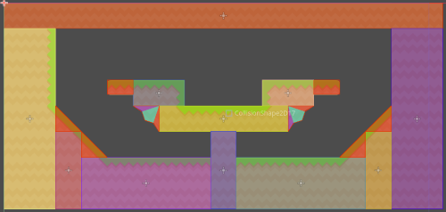
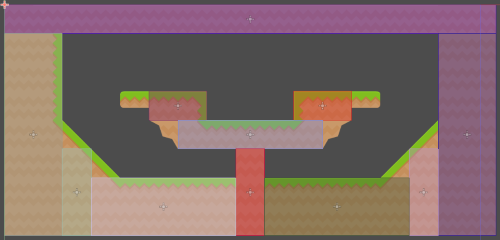
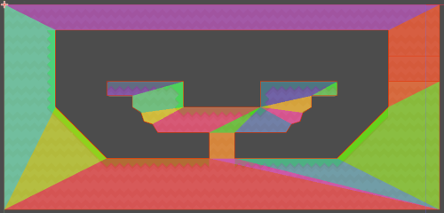
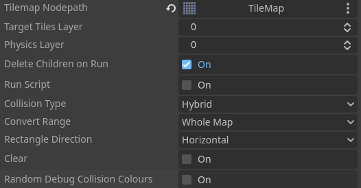

# Godot Advanced Tilemap Collision Baker

This routine came about because I was experiencing issues with boxes sticking when being pushed on a tilemap. Googling the issue it seems like this has been an issue for a number of years so I'm suprised it's still an issue. My findings so far is that you can tweak physics settings to improve things but unfortunately it doesn't seem to guarantee it won't happen. By far the best solution is to use a rectangular CollisionShape2D to cover the entire region where you're likely to want the physics to work correctly.

I came across https://github.com/popcar2/GodotTilemapBaker which seemed to give a good solution. However, it's only for solid blocks and doesn't handle slopes and some testing showed it also fails (as of 29/06/2024) in some layouts.

I wrote a version which uses polygons but once I'd done it I realised it's extremely inefficient as it could connect an entire map into a single monstrosity of a polygon which the physics engine would probably have a fit with. So I finally did a hybrid version which does a rectangle pass first and then finishes everything that's left with polygons. 

Hybrid  

Rectangles  

Polygons  

Inspector  

Tilemap Nodepath - Assign you TileMap.  

Target Tiles Layer - Enter the layer ID that contains the physics layer with the collisions.  

Physics Layer - Enter the physics layer ID you want to use.  

Delete Children on Run - Deletes all the collisions inside of the StaticBody2D when the script runs.

Run Script - Looks like a checkbox but click this to run the script.  

Collision Type  
* Rectangle  
Creates the largest rectangular regions it can. It only handles square collision polygons that cover the whole tile so does not support any form of slope.
* Polygons  
Creates polygons that should be able to handle your entire map. It could potentially create extremely detailed polygons which would be very inefficient for the physics engine to use.
* Hybrid  
The default and best option does a rectangle pass and then covers the remaining tiles with a polygon pass.

Convert Range  
* Whole Map  
The default is to convert the whole map.
* Viewport Only  
To avoid complicated solutions you can convert only what you see in the current viewport.

Rectangle Direction
* Horizontal  
The default option which favors wider regions which are ideal for platform games.
* Vertical  
Favors taller regions which may be better if your game favors the vertical format.

Clear - Click to immediately delete all the collisions inside of the StaticBody2D.

Random Debug Collision Colours - Assigns a random colour to each rectangular collision to make visibility easier.

